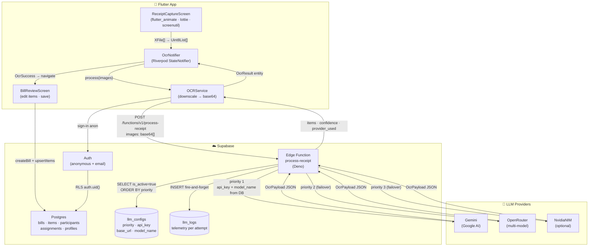

# BagiStruk — Technical Documentation

**Status: End-to-end live** — capture → OCR (Flutter → Edge Function → LLM) → Review & Edit → Split → **Settlement** (per-participant `is_paid` toggle, auto `bills.is_settled`). Lazy anonymous sign-in (only when an action needs `auth.uid()`) so persisted email sessions survive restart. Per-user insert rate limit enforced at the database level. Profile & Settings screen with dynamic locale (ID/EN), ThemeMode, and multi-currency formatter.

---

## 1. Architecture

### Diagram



### Layer Overview

```
presentation/  →  domain/  ←  data/
   │                            │
   └─ providers (Riverpod)  ────┘
   │                            │
   └────  Supabase Flutter SDK  ┘
                │
                ├── PostgREST (CRUD bills/items/participants/assignments)
                ├── Auth      (anonymous + email promotion)
                └── Functions (`process-receipt` Edge Function)
                       │
                       └─ supabase-js service-role
                            ├── SELECT llm_configs WHERE is_active=true ORDER BY priority
                            ├── INSERT llm_logs (telemetry per attempt)
                            └── fetch() → Gemini / OpenRouter / NvidiaNIM
```

**Design principles:**
- All LLM API keys live in `llm_configs` (server-side only). Never bundled in the client.
- Provider failover = rows with increasing `priority`. Swapping a provider, model, or key requires no redeploy.
- `llm_logs` records every attempt (success and failure) fire-and-forget so it never blocks the user response.

---

## 2. Database Schema

Migrations are in `supabase/migrations/` and applied with `supabase db push`.

### `20260427141418_init_bagistruk_schema.sql`

Core application tables:

| Table | Purpose | Notes |
|---|---|---|
| `profiles` | User profile extending `auth.users`, includes `bank_accounts` JSONB | `update_updated_at_column` trigger active |
| `bills` | Bill header (title, total, tax, service, settled flag) | RLS: `owner_id = auth.uid()` only |
| `items` | Line items per bill (name, price, qty) | RLS via JOIN to `bills.owner_id` |
| `participants` | People sharing the bill | RLS via JOIN to `bills.owner_id` |
| `item_assignments` | M2M items ↔ participants with `share_weight` | Enables unequal splits |
| `llm_configs` | Provider/key/model rotation for the Edge Function | RLS added in migration 2 |
| `llm_logs` | Audit log of every LLM call | RLS added in migration 2 |

### `20260428090000_qty_numeric_and_llm_rls.sql`

- `items.qty INTEGER → NUMERIC(10,3)` — supports fractional quantities (e.g. `qty=0.58` kg). Matches `Item.qty: double` in the domain layer.
- `llm_configs` and `llm_logs` get `ENABLE ROW LEVEL SECURITY` with **no policies** — intentional, so only the service-role key (Edge Function) can read `api_key`. The anon/authenticated key cannot.

### `20260428120000_bills_receipt_date.sql`

- Adds nullable `receipt_date DATE` to `bills` — the date printed on the receipt as extracted by OCR, separate from `created_at` (the time the user saved).

### `20260428130000_bills_insert_rate_limit.sql`

- `BEFORE INSERT` trigger on `bills`: hard limit of **30/hour** and **200/day** per `owner_id`. Exceeding the limit raises a `P0001` exception.
- `service_role` bypasses the limit (for admin/seed operations).
- Index on `(owner_id, created_at DESC)` keeps the count-window query fast as the table grows.

### `20260501120000_profiles_preferences.sql`

- Adds four preference columns to `profiles`: `display_name TEXT`, `default_currency TEXT DEFAULT 'IDR'`, `language_pref TEXT DEFAULT 'id'`, `theme_pref TEXT DEFAULT 'system'`.
- DB function `ensure_profile_for_user()` + trigger `on_auth_user_created`: auto-inserts a `profiles` row (`ON CONFLICT DO NOTHING`) for every new `auth.users` row, so the profile is always present when the client first calls `getCurrentProfile()`.

### `20260502090000_fix_ensure_profile_search_path.sql`

- **Fixes "database error creating anonymous user"** — `ensure_profile_for_user()` ran in the `auth.users` execution context where `public` is NOT on the `search_path`. The bare `profiles` reference raised `relation "profiles" does not exist`, blocking every anonymous (and email) sign-up.
- Fix: recreates the function with `SET search_path = ''` and fully-qualified table `public.profiles`. Drops and recreates the trigger to point at the rebuilt function body.

---

## 3. Edge Function: `process-receipt`

Source: [supabase/functions/process-receipt/index.ts](supabase/functions/process-receipt/index.ts) (Deno)

### Wire Format

```ts
// POST /functions/v1/process-receipt
// Request body
{ images: string[],  // base64 JPEG, no `data:` prefix
  hint?: string,
  currency?: string }  // ISO 4217, default 'IDR' — drives locale-aware
                       // parsing rules in the system prompt and the
                       // zero-decimal post-process heuristic

// Response 200
{ items: [{ name, price, qty }],
  detected_total: number | null,
  detected_tax: number | null,
  detected_service: number | null,
  merchant: string | null,
  receipt_date: string | null,   // ISO 8601
  confidence: number,            // 0..1
  provider_used: string }        // matches llm_configs.provider_name

// Response 4xx/5xx
{ error: 'invalid_json' | 'images_required' | 'method_not_allowed' |
         'no_active_provider' | 'llm_configs_load_failed' |
         'all_providers_failed' | 'supabase_env_missing',
  attempts?: [{ provider, status, message }] }  // present on all_providers_failed
```

### Request Lifecycle

1. **CORS preflight** — `OPTIONS` → 204.
2. **Validate body** — `images: string[]` must be non-empty with all string values. Otherwise 400.
3. **Init service-role client** — uses `SUPABASE_URL` + `SUPABASE_SERVICE_ROLE_KEY` (auto-injected by Supabase, no manual setup).
4. **Query `llm_configs`** — `is_active=true ORDER BY priority ASC`. Error or empty result → 500 `no_active_provider`.
5. **Failover loop** — for each row:
   - System prompt is built per-request via `buildSystemPrompt(currency)` — appends locale rules ('.' is thousand separator in ID/EU; '.' is decimal in US/UK) and, for zero-decimal currencies (`IDR / JPY / KRW / VND / CLP / ISK / HUF / TWD`), a hard rule that every numeric output must be a JSON integer.
   - Dispatches to `callProvider(cfg, images, currency, hint)` by `cfg.provider_name.toLowerCase()`:
     - `gemini` → Gemini REST (`POST /v1beta/models/{model}:generateContent`)
     - `openrouter` → OpenAI-compatible (`POST {base_url}/chat/completions`)
     - `nvidianim` → placeholder `not_implemented`
     - unknown → `ProviderError('unsupported_provider', 400)`
   - `model_name` and `api_key` always come from the DB row — no hardcoded defaults.
   - Fire-and-forget INSERT to `llm_logs` (image_count, model, latency_ms, status_code, error/summary).
   - Success → return 200 immediately.
   - Retryable failure (`429 / 5xx / 408`) → continue to next row.
   - Non-retryable failure (other 4xx) → break loop.
6. **Post-process** — on the first successful payload, `normalizePayload(payload, currency)` runs before `jsonResponse`. For zero-decimal currencies it forces every numeric field (`item.price`, `detected_total`, `detected_tax`, `detected_service`) to an integer by reconstructing from the string form: a value the JSON parser saw as `10.455` is restripped to `10455`. This is the safety net for cases where the LLM ignores the prompt rule and still returns a fractional value (the most common Indonesian-receipt failure mode).
7. **No successful payload** → 502 `all_providers_failed` with `attempts` array detailing each tried provider.

### URL Builder Per Provider

| Provider | `base_url` in DB | Final URL constructed |
|---|---|---|
| Gemini | `https://generativelanguage.googleapis.com` (host only) | `…/v1beta/models/{model}:generateContent?key={api_key}` |
| Gemini | `https://generativelanguage.googleapis.com/v1beta` | `…/models/{model}:generateContent?key={api_key}` |
| OpenRouter | `https://openrouter.ai/api/v1` | `…/chat/completions` |
| OpenRouter | `https://openrouter.ai/api/v1/chat/completions` | used as-is |

The builder is defensive — all conventions above are handled without double-appending path segments.

---

## 4. Flutter Pipeline

### End-to-End Flow

```
ImagePicker.pickMultiImage()
   │  XFile[]
   ▼
[receipt_capture_screen.dart]
   │  - Empty state: placeholder illustration + motivational copy (fade-in)
   │  - Image preview: M3 Card, green accent border (colorScheme.primary), radius 20
   │  - Scan button: fade-in + slide-up via flutter_animate when images are ready
   │  - Scanning overlay: Lottie (assets/lottie/scanning.json) inside the card area
   │  - Status text: shimmer while processing (flutter_animate)
   │  - ref.listen(ocrProvider) → push BillReviewScreen on OcrSuccess
   │
   ▼
[OcrNotifier].process(images, hint)             // presentation/ocr/providers/ocr_notifier.dart
   │  state: idle → processing(count) → success(OcrResult) | failure(Failure)
   ▼
[OcrRepositoryImpl] → [OCRService]              // downscale + invoke Edge Function
   │  ImageCodec.downscaleToBase64 (max 1600px, JPEG q85) — runs in parallel
   │  supabaseClient.functions.invoke('process-receipt', body)
   ▼
Supabase Edge Function (Section 3)
   │  OcrResponseDto.fromJson() → OcrResult entity
   ▼
[bill_review_screen.dart]
   │  - Title pre-filled from ocr.merchant
   │  - Confidence chip shown when ocr.confidence < 0.8
   │  - Receipt date row shown when ocr.receiptDate != null (read-only)
   │  - Editable items list (name, qty: double, price)
   │  - Tax & Service: numeric TextFields, pre-filled from detected_*
   │  - Mismatch banner when |computedTotal − detectedTotal| > 1.0
   │  - Suspect-thousands banner when currency is zero-decimal but any
   │    price/tax/service is fractional (locale safety net — see §13)
   │  - Save → IBillRepository.createBill + upsertItems
   ▼
Supabase PostgREST (tables: bills + items)
   │  BEFORE INSERT trigger: bills_insert_rate_limit (30/hr, 200/day)
   │  RLS: bills.owner_id = auth.uid()
   ▼
[bill_split_screen.dart]
   │  - Add participants, assign items per person (avatar tap → item tap)
   │  - Per-toggle persist via replaceAssignments
   │  - "Selesai" → pushReplacement to bill detail screen
   ▼
[bill_detail_screen.dart]                         // settlement loop
   │  - Header: merchant + receipt date (longDate id_ID) + total + settled badge
   │  - Per-participant Switch toggles `participants.is_paid` (optimistic UI)
   │  - On full settlement: auto-flip `bills.is_settled = true`
   │  - Reverse-flip when any participant un-toggled
```

### UI Package Roles (Scan Screen)

| Package | Used for |
|---|---|
| `flutter_animate` | fade-in/slide-up of the Scan button, shimmer on status text, fade-in empty state |
| `lottie` | scanning animation overlaid on the image card (`assets/lottie/scanning.json`) |
| `flutter_screenutil` | all dimensions via `.w/.h/.r/.sp` — baseline iPhone 12 (390×844) |

---

## 5. LLM Configuration (`llm_configs`)

Each row is one provider option, consumed in ascending `priority` order. **`model_name` is required** — the Edge Function has no fallback default.

```sql
INSERT INTO llm_configs(provider_name, api_key, base_url, model_name, priority, is_active) VALUES
-- Gemini as primary (priority 1)
('gemini',     'AIza...',   'https://generativelanguage.googleapis.com', 'gemini-2.0-flash',                1, TRUE),
-- OpenRouter as fallback (priority 2)
('openrouter', 'sk-or-...', 'https://openrouter.ai/api/v1',             'google/gemini-2.0-flash-exp:free', 2, TRUE);
```

**Operational rules:**
- `is_active=false` — row is skipped without deletion.
- `model_name` must be explicit. If NULL or empty, the attempt is logged to `llm_logs` as `config_invalid` and the loop continues.
- Key rotation: `UPDATE llm_configs SET api_key='...' WHERE id=...` — no redeploy needed.
- Model rotation: `UPDATE llm_configs SET model_name='...' WHERE id=...` — takes effect on the next request.
- `base_url` conventions:
  - Gemini: `https://generativelanguage.googleapis.com` (host only) — the Edge Function appends `/v1beta/models/...`.
  - OpenRouter: `https://openrouter.ai/api/v1` (no `/chat/completions`) — the Edge Function appends the endpoint.

**Verify valid Gemini models:**
```bash
curl "https://generativelanguage.googleapis.com/v1beta/models?key=$KEY" \
  | jq -r '.models[] | select(.supportedGenerationMethods[]? == "generateContent") | .name'
```

---

## 6. Telemetry (`llm_logs`)

Fire-and-forget insert per attempt (success and failure):

```sql
-- Sample: inspect recent calls
SELECT provider, status_code, latency_ms, response_payload
FROM llm_logs ORDER BY created_at DESC LIMIT 5;
```

- `bill_id` is NULL during OCR (a bill doesn't exist yet when scanning occurs).
- `request_payload` does not store base64 — only `{ model, image_count, hint }`.
- `response_payload` on success: `{ items_count, confidence }`. On failure: `{ error: "..." }`.

**Monitoring query:**
```sql
-- Error rate per provider over the last 24 hours
SELECT provider,
       COUNT(*) FILTER (WHERE status_code = 200) AS success,
       COUNT(*) FILTER (WHERE status_code <> 200) AS fail,
       AVG(latency_ms)::int AS avg_ms
FROM llm_logs
WHERE created_at > now() - interval '24 hours'
GROUP BY provider
ORDER BY provider;
```

---

## 7. Adding a New LLM Provider

### OpenAI-compatible providers (Groq, Together, DeepSeek, etc.)

Insert a new row — no code change required:
```sql
INSERT INTO llm_configs(provider_name, api_key, base_url, model_name, priority, is_active)
VALUES ('groq', 'gsk_...', 'https://api.groq.com/openai/v1', 'llama-3.3-70b-versatile', 3, TRUE);
```
Then add `case "groq": return await callOpenRouter(cfg, images, hint);` in the dispatcher (or refactor into a shared `callOpenAICompatible` helper).

### Providers with a custom wire format (Anthropic, etc.)

1. Add `case "anthropic"` in the dispatcher (`index.ts`).
2. Write `callAnthropic(cfg, images, hint)` with `x-api-key` and `anthropic-version` headers.
3. Insert a row into `llm_configs`.
4. Deploy: `supabase functions deploy process-receipt`.

---

## 8. Auth & Multi-Device

- **Lazy anonymous sign-in.** [lib/main.dart](lib/main.dart) no longer calls `signInAnonymously()` at startup — that previously raced with `Supabase.initialize()`'s session restoration and overwrote a freshly-restored email session. Instead, [`IAuthRepository.ensureSignedIn()`](lib/data/datasources/auth_remote_datasource.dart) is called from action sites that require `auth.uid()` (currently the OCR `_process()` in [receipt_capture_screen.dart](lib/presentation/ocr/screens/receipt_capture_screen.dart)). It's idempotent: returns the existing user id when a session already exists, anonymous-signs-in only when there is none.
- **Session persistence is automatic** — `supabase_flutter` uses Hive/SharedPreferences locally, so previously-signed-in users (anonymous or email) stay signed-in across cold starts.
- **Anonymous sign-in must be enabled** in the Supabase Dashboard → Authentication → Providers, otherwise `ensureSignedIn()` fails when there is no session.
- `AuthRemoteDataSource` supports **promote to email** — an anonymous user can register without losing their bills (Supabase preserves `auth.uid()` when linking the identity). Logging into an existing account from an anonymous session calls the `migrate_anon_data` RPC to re-assign rows to the new uid.
- RLS on all tables filters by `auth.uid()` via `bills.owner_id`.

---

## 9. Smoke Test (`smoketest.sh`)

```bash
./smoketest.sh                      # uses default photo_2026-04-28_08-41-22.jpg
./smoketest.sh path/to/other.jpg
```

Reads `SUPABASE_URL` and `SUPABASE_ANON_KEY` from `.env`. Exit 0 only on HTTP 200.

---

## 10. Known Limitations & Next Steps

- **No CAPTCHA** — anonymous sign-in has no bot protection. The `bills` rate limit is a defensive layer, not a substitute.
- **`participants` has no `user_id` column** — bill splitting is currently owner-centric. There is no share link to send a participant their portion.
- **No bill edit screen for items/totals** — the bill detail screen (settlement) lets the owner toggle payment status and auto-flip `is_settled`, but there's no UI to reopen and re-edit the items, tax, service, or merchant of a saved bill.
- **Lottie asset** at `assets/lottie/scanning.json` is still a placeholder — replace with the final animation before release.
- **Edge Function has no self-rate-limit** — relies on the Supabase project quota. Consider a `cooldown_until` column in `llm_configs` for a circuit-breaker pattern.
- **Weekly `llm_logs` audit** is not automated — a candidate for a scheduled agent.
- **Partial i18n** — bill review/split/detail and OCR error messages still have hardcoded Indonesian strings. See §12 TODO table.

---

---

## 11. Profile & Settings

Added in migration `20260501120000_profiles_preferences.sql`:
- Four new columns on `profiles`: `display_name TEXT`, `default_currency TEXT DEFAULT 'IDR'`, `language_pref TEXT DEFAULT 'id'`, `theme_pref TEXT DEFAULT 'system'`.
- DB trigger `on_auth_user_created` auto-inserts a `profiles` row for every new auth user (anon or email). Client also upserts defensively on every `getCurrentProfile()` call.

**Trigger search_path fix** (`20260502090000_fix_ensure_profile_search_path.sql`): the original function used bare `profiles` (no schema). Because `SECURITY DEFINER` functions fire in the `auth.users` execution context — where `public` is NOT on the `search_path` — this raised `relation "profiles" does not exist` and blocked every new sign-up. Fixed by adding `SET search_path = ''` and qualifying the table as `public.profiles`.

**Anonymous restrictions:** anonymous sessions cannot rename themselves. The Settings UI hides the **Change Name** tile entirely while `profile.isAnonymous == true` and shows a locale-aware generic label ("Saya" / "Me") instead of the stored `display_name`. The auto-added first participant on the Split screen uses the same label (chosen by `profile.languagePref`). This is a soft nudge to register; renaming becomes available the moment the user promotes the session to an email account.

**About page:** [lib/presentation/about/screens/about_screen.dart](lib/presentation/about/screens/about_screen.dart) shows the app logo, version + build number (via `package_info_plus.PackageInfo.fromPlatform()`), author info ("Alam Aby Bashit"), and tappable link tiles for the landing page, GitHub, LinkedIn, Buy Me a Coffee, Saweria, and Patreon. URLs live as `const String k…Url` at the top of the file with `'#'` placeholders — replace with real URLs when available. Tapping a tile uses `url_launcher` (`LaunchMode.externalApplication`); a `'#'` placeholder shows a snackbar via the localized `linkUnavailable` key. Reached via `Routes.about` (`/about`) from a "Tentang Aplikasi / About App" tile in the Settings tab.

A **Privacy Policy** tile (`Icons.privacy_tip_outlined`) has been added to the About page. It navigates via `context.pushNamed(Routes.privacyPolicyName)` to [lib/presentation/about/screens/privacy_policy_screen.dart](lib/presentation/about/screens/privacy_policy_screen.dart), which renders bilingual policy sections (ID/EN) chosen from `Localizations.localeOf(context).languageCode`. A Markdown version for public hosting is at [docs/privacy-policy.md](docs/privacy-policy.md) — the URL of that hosted page must be submitted to Play Console → App content → Privacy policy (required because the app uses CAMERA and stores user data in Supabase).

**New Dart files (§11 batch):**

| Path | Role |
|---|---|
| `lib/domain/entities/user_profile.dart` | `@freezed` UserProfile entity |
| `lib/domain/repositories/i_profile_repository.dart` | CRUD interface |
| `lib/data/dtos/profile_dto.dart` | `@JsonSerializable` DTO |
| `lib/data/datasources/profile_remote_datasource.dart` | PostgREST wrapper |
| `lib/data/repositories/profile_repository_impl.dart` | `Result<T>`-wrapped impl |
| `lib/presentation/settings/providers/profile_notifier.dart` | `keepAlive` async notifier; watches `authStateProvider`; returns synthetic default when no session — prevents the keepAlive error cache forming on cold start |
| `lib/presentation/settings/providers/preferences_providers.dart` | `localePrefProvider`, `themeModePrefProvider`, `currencyPrefProvider` — derived from `profileProvider` |
| `lib/presentation/settings/providers/settings_actions.dart` | `performLogout` — invalidates all user-scoped providers then calls `ensureSignedIn()` for a fresh anon session |
| `lib/presentation/settings/screens/settings_screen.dart` | Account + Preferences UI; anonymous guard auto-opens paywall |
| `lib/presentation/settings/widgets/` | `edit_name_sheet`, `confirm_dialog`, `currency_picker_dialog`, `language_picker_dialog`, `theme_picker_dialog` |
| `lib/presentation/about/screens/about_screen.dart` | About page — version, author, donation/profile links |
| `lib/core/format/currency_formatter.dart` | `CurrencyFormatter.of(code)` — `NumberFormat` factory for IDR/USD/MYR/AUD/SGD/SAR |

**Cold-start safety:** `profileProvider` watches `authStateProvider` and returns `UserProfile(id:'', isAnonymous:true)` when `userId==null`. This prevents the `keepAlive` error cache from forming before a session exists.

**Post-login routing:** Settings tab passes `from: Routes.settings` through `showPaywallSheet` → login URL `?from=` query param → `LoginScreen.from` field → `context.go(widget.from)` on success, landing the user back on the Settings tab instead of History.

---

---

## 14. Android Release Configuration (Play Store)

**Package / Application ID:** `com.alamaby.bagistruk` (set in `android/app/build.gradle.kts` as both `namespace` and `applicationId`). This value is immutable once the first AAB is uploaded to Play Console.

**SDK levels** — pinned explicitly to avoid surprises when bumping the Flutter SDK:
- `compileSdk = 36`, `targetSdk = 36` (Android 16 — Play Store requires ≥ 35 from Aug 2025, ≥ 36 expected Aug 2026)
- `minSdk = flutter.minSdkVersion` (remains dynamic for broad device coverage)

**Side-effect of targetSdk = 36:**
- **Edge-to-edge enforced** by the OS — `Scaffold` content must not be obscured by status/navigation bars. Test on an emulator running API 36.
- **Predictive back gesture** is active by default — test GoRouter back navigation.

**R8 / ProGuard** — enabled for all `release` builds:
```kotlin
isMinifyEnabled = true
isShrinkResources = true
proguardFiles(getDefaultProguardFile("proguard-android-optimize.txt"), "proguard-rules.pro")
```
Keep rules for Flutter embedding are in `android/app/proguard-rules.pro`.

**Signing** — reads from `android/key.properties` (gitignored). Falls back to debug key when the file is absent so `flutter run --release` still works in fresh clones and CI debug jobs.
- `storeFile` is relative to `android/app/` (Gradle module root), so the entry is `../upload-keystore.jks` pointing to `android/upload-keystore.jks`.
- Template: `android/key.properties.example` (committed, passwords omitted).

**Adaptive icon** — configured via `flutter_launcher_icons` in `pubspec.yaml`. Run `dart run flutter_launcher_icons` after any icon asset change. Current foreground reuses `assets/images/icon_launcher.png` as a placeholder — replace with a 1024×1024 PNG padded to the inner 66% safe zone before the first Play Store upload.

**CI / GitHub Actions:**
- `release.yml` — triggered by `v*.*.*` tags; builds split-per-ABI APKs for GitHub Releases.
- `playstore.yml` — triggered manually (`workflow_dispatch`); builds a signed AAB and uploads it as a workflow artifact (30-day retention) for manual upload to Play Console. Placeholder comment marks where `r0adkll/upload-google-play` can be added once a Google service account is available.

**GitHub secrets vs variables:**

| Kind | Name | Purpose |
|------|------|---------|
| Secret | `KEYSTORE_BASE64` | Base64-encoded `upload-keystore.jks` |
| Variable | `KEY_ALIAS` | Keystore key alias (non-sensitive) |
| Secret | `KEY_PASSWORD` | Key password |
| Secret | `STORE_PASSWORD` | Keystore password |
| Variable | `SUPABASE_URL` | Project URL (already bundled in APK) |
| Secret | `SUPABASE_ANON_KEY` | Supabase anon key |

---

## 12. Localization (i18n)

**Generator:** Flutter's built-in `gen-l10n` (`flutter: generate: true` in `pubspec.yaml`; config in `l10n.yaml` at project root).

**Template:** `lib/l10n/app_id.arb` (Bahasa Indonesia — source of truth).  
**Translation:** `lib/l10n/app_en.arb` (English).  
**Output:** `lib/l10n/generated/app_l10n.dart` (auto-generated — do not edit directly).

**Usage:** `AppL10n.of(context).<key>` — consistent pattern throughout the app.

**Wiring in `app.dart`:** `MaterialApp.router` receives `locale:` from `localePrefProvider` (via `profileProvider`) and `themeMode:` from `themeModePrefProvider`. `localizationsDelegates` and `supportedLocales` come from `AppL10n`.

**Screens localized:**
- Shell / bottom nav (`main_shell_screen.dart`)
- Scan (`receipt_capture_screen.dart`)
- Settings (`settings_screen.dart` + all widgets)
- Auth (`login_screen.dart`, `register_screen.dart`, `verify_email_screen.dart`)
- History (`history_screen.dart`)
- Bill split summary (`split_summary_sheet.dart`)

### TODO: remaining hardcoded strings

The following files still contain hardcoded Indonesian strings. Localize in a future pass:

| File | Hardcoded strings |
|---|---|
| `lib/presentation/bills/screens/bill_review_screen.dart` | AppBar title, item labels, save button, confidence chip, mismatch banner |
| `lib/presentation/bills/screens/bill_split_screen.dart` | Participant add/edit UI, item assignment labels |
| `lib/presentation/bills/screens/bill_detail_screen.dart` | Settlement labels, participant toggle text |
| `lib/presentation/ocr/utils/ocr_messages.dart` | Error title/body strings for all `OcrFailure` cases |
| `lib/main.dart` | Supabase initialization error message |
| `lib/presentation/bills/widgets/split_summary_sheet.dart` (`_buildShareText`) | WhatsApp message body (non-UI, lower priority) |

---

## 13. Locale-aware OCR Pricing

Receipts in Indonesian, German, and most European locales use `.` as a thousand separator and `,` as a decimal separator — the inverse of US/UK convention. Vision LLMs (Gemini, OpenRouter routes) trained primarily on English data tend to read `"Rp 10.455"` as `10.455` (ten point four five five) instead of `10455` (ten thousand four hundred fifty-five). When this happens, every line item is silently scaled down by ~1000×, the receipt's printed grand total is also misread the same way, so the simple "computed vs detected" mismatch banner does NOT fire — the user gets a wrong bill with no warning.

The fix is defense-in-depth, currency-aware:

1. **Client passes currency.** [`receipt_capture_screen.dart`](lib/presentation/ocr/screens/receipt_capture_screen.dart) reads `profileProvider.value?.defaultCurrency` (default `'IDR'`) and pipes it through `OcrNotifier.process(..., currency:)` → `OCRService` → `OcrRequestDto.currency`.
2. **Server prompt is currency-aware.** [`buildSystemPrompt(currency)`](supabase/functions/process-receipt/index.ts) appends explicit locale rules ('.' = thousand separator in ID/EU receipts) and, for zero-decimal currencies, a hard "every numeric output must be an integer" rule.
3. **Server post-process heuristic.** `normalizePayload(payload, currency)` runs after the LLM responds. For currencies in `ZERO_DECIMAL_CURRENCIES = {IDR, JPY, KRW, VND, CLP, ISK, HUF, TWD}`, every fractional value is reconstructed via `parseInt(String(v).replace(/\./g,''), 10)` — `10.455 → "10.455" → "10455" → 10455`. Other currencies pass through untouched (USD `12.50` stays `12.50`).
4. **Client safety net.** [`BillReviewState.suspectThousandsBug`](lib/presentation/bills/providers/bill_review_notifier.dart) flags the case where the currency is zero-decimal yet any price/tax/service still has a fractional part (i.e. both prompt + heuristic missed it). `bill_review_screen.dart` shows a red `_SuspectThousandsBanner` above the mismatch banner asking the user to verify before saving. Localized via `reviewSuspectThousandsBug`.

`AppConstants.zeroDecimalCurrencies` mirrors the server-side set so prompts, heuristic, and client banner stay in sync. Adding a new zero-decimal currency requires updating both lists.

---

## Appendix: Key Files

| Path | Role |
|---|---|
| [lib/main.dart](lib/main.dart) | Entry point: dotenv load, Supabase init (no eager anon — session restored from local storage; lazy anon via `ensureSignedIn`) |
| [lib/core/config/env.dart](lib/core/config/env.dart) | Typed accessors: `Env.supabaseUrl`, etc. |
| [lib/core/config/app_constants.dart](lib/core/config/app_constants.dart) | `ocrLowConfidenceThreshold`, `billTotalMismatchTolerance`, `ocrMaxImageEdgePx`, `zeroDecimalCurrencies` (mirrors the server-side set) |
| [lib/core/theme/app_theme.dart](lib/core/theme/app_theme.dart) | Material 3, seed color `Color(0xFF2E7D5B)` (receipt-paper green) |
| [lib/core/router/app_router.dart](lib/core/router/app_router.dart) | go_router routes: list → capture → review |
| [lib/data/services/ocr_service.dart](lib/data/services/ocr_service.dart) | Edge Function client (downscale + invoke) |
| [lib/presentation/ocr/screens/receipt_capture_screen.dart](lib/presentation/ocr/screens/receipt_capture_screen.dart) | Capture UI: empty state, card preview, Lottie overlay, shimmer, button animation |
| [lib/presentation/ocr/widgets/receipt_preview_component.dart](lib/presentation/ocr/widgets/receipt_preview_component.dart) | M3 image card (green border, radius 20), floating remove button |
| [lib/presentation/ocr/providers/ocr_notifier.dart](lib/presentation/ocr/providers/ocr_notifier.dart) | OCR state machine (idle / processing / success / failure) |
| [lib/presentation/bills/screens/bill_review_screen.dart](lib/presentation/bills/screens/bill_review_screen.dart) | Review/edit form + save bill |
| [lib/presentation/bills/screens/bill_split_screen.dart](lib/presentation/bills/screens/bill_split_screen.dart) | Item-to-participant assignment with avatar selection + animated stack |
| [lib/presentation/bills/providers/split_notifier.dart](lib/presentation/bills/providers/split_notifier.dart) | Split state machine; `replaceAssignments` per toggle, proportional totals |
| [lib/presentation/bills/screens/bill_detail_screen.dart](lib/presentation/bills/screens/bill_detail_screen.dart) | Settlement loop: per-participant payment toggle + auto-settle bill |
| [lib/presentation/bills/providers/bill_detail_notifier.dart](lib/presentation/bills/providers/bill_detail_notifier.dart) | `toggleParticipantPaymentStatus` with optimistic UI + auto-settle evaluation |
| [lib/domain/services/bill_calculator.dart](lib/domain/services/bill_calculator.dart) | Pure logic for distributing tax/service per participant |
| [supabase/functions/process-receipt/index.ts](supabase/functions/process-receipt/index.ts) | Edge Function: DB-driven provider rotation + telemetry |
| [supabase/migrations/](supabase/migrations/) | Postgres schema, RLS, and rate-limit trigger |
| [assets/lottie/scanning.json](assets/lottie/scanning.json) | Scanning animation (replace with final Lottie before release) |
| [.env.example](.env.example) | Client env template (anon key only) |
| [smoketest.sh](smoketest.sh) | CLI E2E test for the Edge Function |
| [lib/l10n/app_id.arb](lib/l10n/app_id.arb) | ARB source — Bahasa Indonesia (template for all UI strings) |
| [lib/l10n/app_en.arb](lib/l10n/app_en.arb) | ARB translation — English |
| [lib/l10n/generated/app_l10n.dart](lib/l10n/generated/app_l10n.dart) | Auto-generated localization class (do not edit) |
| [lib/core/format/currency_formatter.dart](lib/core/format/currency_formatter.dart) | Multi-currency `NumberFormat` factory (IDR/USD/MYR/AUD/SGD/SAR) |
| [lib/presentation/settings/screens/settings_screen.dart](lib/presentation/settings/screens/settings_screen.dart) | Profile & Settings UI; hides Change-Name tile for anonymous users; About entry point |
| [lib/presentation/about/screens/about_screen.dart](lib/presentation/about/screens/about_screen.dart) | About page: version (`package_info_plus`), author, donation/profile links via `url_launcher`, Privacy Policy tile |
| [lib/presentation/about/screens/privacy_policy_screen.dart](lib/presentation/about/screens/privacy_policy_screen.dart) | In-app privacy policy — bilingual (ID/EN) based on active locale; required for Play Store |
| [docs/privacy-policy.md](docs/privacy-policy.md) | Public Markdown privacy policy — host on GitHub Pages or similar, submit URL to Play Console |
| [android/app/build.gradle.kts](android/app/build.gradle.kts) | Android build config: package `com.alamaby.bagistruk`, SDK 36, R8, release signing via `key.properties` |
| [android/key.properties.example](android/key.properties.example) | Signing credentials template (committed); copy to `key.properties` and fill in passwords |
| [android/app/proguard-rules.pro](android/app/proguard-rules.pro) | R8 keep rules for Flutter embedding and plugins |
| [.github/workflows/playstore.yml](.github/workflows/playstore.yml) | Manual `workflow_dispatch` workflow — builds signed AAB and uploads as artifact for Play Console |
| [.github/workflows/release.yml](.github/workflows/release.yml) | Tag-triggered workflow — builds split-per-ABI APKs for GitHub Releases |
| [lib/presentation/settings/providers/profile_notifier.dart](lib/presentation/settings/providers/profile_notifier.dart) | `keepAlive` profile state — cold-start safe |
| [lib/presentation/settings/providers/preferences_providers.dart](lib/presentation/settings/providers/preferences_providers.dart) | Locale / ThemeMode / currency pref providers |
| [supabase/migrations/20260501120000_profiles_preferences.sql](supabase/migrations/20260501120000_profiles_preferences.sql) | Profiles preference columns + auto-create trigger |
| [supabase/migrations/20260502090000_fix_ensure_profile_search_path.sql](supabase/migrations/20260502090000_fix_ensure_profile_search_path.sql) | Fixes `ensure_profile_for_user` search_path bug — `SET search_path = ''`, fully-qualified `public.profiles` |
