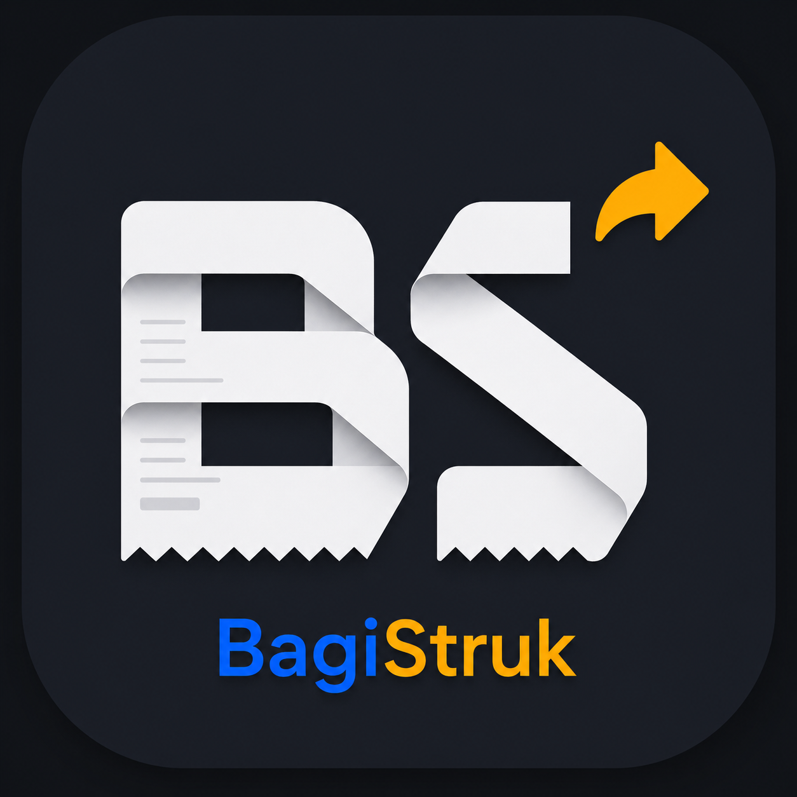
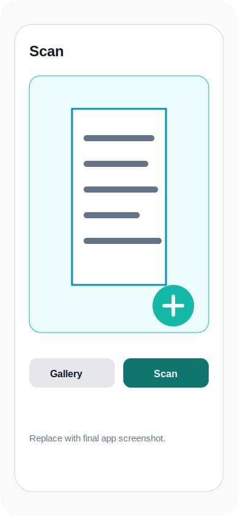
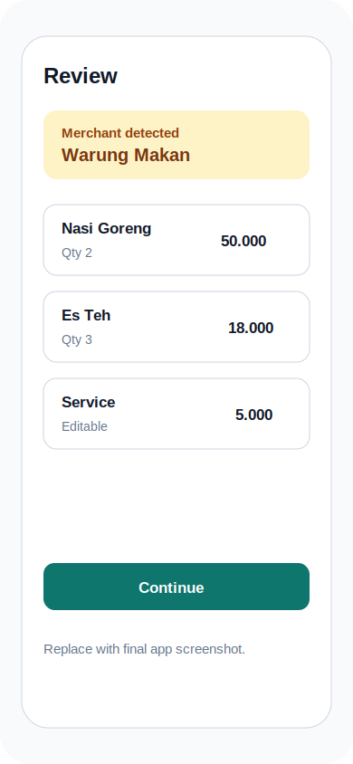
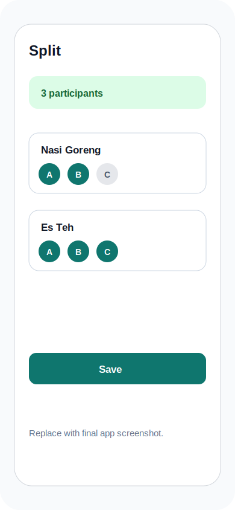
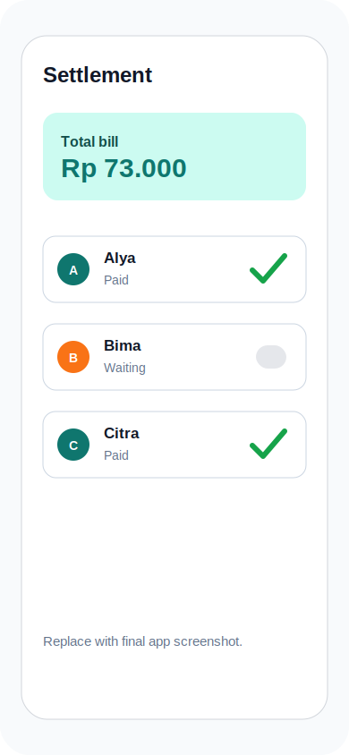

# BagiStruk

<p align="center">
  
</p>

[](https://flutter.dev)
[](https://dart.dev)
[](LICENSE)
[](https://github.com/alamaby/bagistruk/actions/workflows/playstore.yml)

**BagiStruk** is a Flutter app that splits bills from receipt photos. Snap one or more receipts, let the AI extract every line item, review and edit the results, then assign items to participants — tax and service charges are distributed proportionally.

## Project Status

BagiStruk is in active development and preparing for Google Play internal testing. See [TODO_RELEASE.md](TODO_RELEASE.md) for the current release-readiness checklist.

## Screenshots

Placeholder assets are included so the README and Play Store listing can be filled in consistently once final screenshots are captured.

| Scan receipts | Review bill | Split items | Track settlement |
|---------------|-------------|-------------|------------------|
|  |  |  |  |

---

## Features

- **Receipt OCR** — Upload one or multiple receipt photos. Items, prices, quantities, merchant name, and receipt date are extracted automatically via a multi-provider LLM pipeline (Gemini, OpenRouter, NvidiaNIM with priority-ordered failover).
- **Review & Edit** — Every extracted item is editable before saving: name, quantity (supports decimals for weight/volume), and price. Tax and service amounts are pre-filled from the receipt and can be adjusted.
- **Bill Splitting** — Assign items to participants. Tax and service are distributed proportionally based on each participant's subtotal share.
- **Settlement Loop** — After splitting, a dedicated detail screen tracks per-participant payment status with optimistic toggles. When everyone has paid, the bill is auto-marked settled.
- **Anonymous-first Auth** — Sessions persist across restarts (supabase_flutter local storage). Anonymous sign-in is created lazily on the first action that requires `auth.uid()` (e.g. tapping Scan), so a previously-restored email session is never overwritten. Users can promote an anonymous account to a full email account without losing their bill history. Anonymous users get a generic locale-aware label ("Saya" / "Me") and cannot edit their display name — this nudges them to register if they want personalization.
- **Profile & Settings** — Change display name, default currency, app language, and theme (light / dark / system) from the dedicated Settings tab. Persisted per user account in the `profiles` table. Anonymous users see a "Create Permanent Account" CTA; authenticated users can reset their password or log out.
- **About page** — Dedicated screen with app version (via `package_info_plus`), author info, and link tiles to website / GitHub / LinkedIn / Buy Me a Coffee / Saweria / Patreon. Reachable from the Settings tab.
- **Locale-aware OCR** — User's `default_currency` is sent with each scan so the Edge Function can guide the LLM with the right number-format convention (e.g. for Indonesian / European receipts, `.` is a thousand separator, not a decimal). Server-side post-processing reconstructs integer prices for zero-decimal currencies (IDR, JPY, KRW, VND, CLP, ISK, HUF, TWD), and a client-side safety-net banner warns the user if any extracted price still has a fractional part for a zero-decimal currency.
- **Multi-language** — Full UI localization in Bahasa Indonesia and English. Switch instantly from Settings without restarting the app.
- **Theme** — Light, dark, and system-follow modes. Applied globally and persisted in the user profile.
- **Offline-safe keys** — All LLM API keys are stored server-side in Supabase. No keys are bundled in the app or exposed to the client.
- **Rate-limited inserts** — Database-level trigger enforces 30 bills/hour and 200 bills/day per user to prevent abuse.

---

## Tech Stack

| Layer | Technology |
|-------|-----------|
| Mobile | Flutter stable, Dart 3.11.5+ |
| State management | Riverpod 3 (code-gen), Freezed 3 |
| Navigation | go_router 14 |
| UI utilities | flutter_screenutil, flutter_animate, Lottie |
| Backend | Supabase (Postgres + RLS, Auth, Edge Functions / Deno) |
| LLM | Gemini, OpenRouter, NvidiaNIM — provider config stored in DB |
| Localization | flutter_localizations + ARB gen-l10n (ID / EN) |

---

## Quick Start

### Prerequisites

- Flutter stable with Dart SDK 3.11.5+
- Supabase CLI
- A [Supabase](https://supabase.com) project
- At least one LLM provider API key (Gemini recommended)

### 1. Environment

```bash
cp .env.example .env
# Fill in your values:
# SUPABASE_URL=https://<project>.supabase.co
# SUPABASE_ANON_KEY=<anon-key>
```

### 2. Database schema

```bash
supabase db push
```

### 3. LLM provider

Insert at least one active row into `llm_configs`:

```sql
INSERT INTO llm_configs (provider_name, api_key, base_url, model_name, priority, is_active)
VALUES (
  'gemini',
  '<YOUR_GEMINI_API_KEY>',
  'https://generativelanguage.googleapis.com',
  'gemini-2.0-flash',
  1,
  true
);
```

See [PROJECT_SUMMARY.md §5](PROJECT_SUMMARY.md) for adding fallback providers.

### 4. Enable Anonymous Sign-In

In your Supabase Dashboard: **Authentication → Providers → Anonymous Sign-Ins → Enable**

Without this, inserts into `bills` will be rejected by Row Level Security.

### 5. Enable Google Sign-In

In Google Cloud Console, create OAuth clients for:

- Web application: put this value in `.env` as `GOOGLE_WEB_CLIENT_ID`.
- Android: package name `com.alamaby.bagistruk`, with the debug and release SHA-1 fingerprints.
- iOS: bundle id `com.alamaby.bagistruk`, then put the client id in `.env` as `GOOGLE_IOS_CLIENT_ID`.

In Supabase Dashboard: **Authentication → Providers → Google → Enable**, then add the Google web OAuth client id and secret.

On iOS, also add `CFBundleURLTypes` to `ios/Runner/Info.plist` using the `REVERSED_CLIENT_ID` from Google's iOS client config.

### 6. Deploy the Edge Functions

```bash
supabase functions deploy process-receipt
supabase functions deploy delete-account
supabase functions deploy inactive-user-cleanup --no-verify-jwt
```

The `delete-account` function requires an authenticated user JWT and uses
`SUPABASE_SERVICE_ROLE_KEY` server-side to delete the user's bills before
deleting the Supabase Auth user.

The `inactive-user-cleanup` function is intended for Supabase Cron. It uses
`SUPABASE_SERVICE_ROLE_KEY` server-side, optionally sends reminders with Resend
(`RESEND_API_KEY`, `INACTIVE_REMINDER_FROM`), deletes user bills first, then
soft-deletes expired Auth users. If `INACTIVE_CLEANUP_SECRET` is set, invoke it
with the `x-cleanup-secret` header from Cron.

### 7. Code generation & run

```bash
flutter pub get   # also triggers flutter gen-l10n (ARB → Dart)
dart run build_runner build --delete-conflicting-outputs
flutter run
```

---

## How to Use

1. **Open the app** — your previous session is restored if you have one; otherwise you stay signed-out until your first action.
2. **Tap the camera button** on the home screen to pick one or more receipt photos from your gallery.
3. **Tap Scan** — an anonymous session is created on the fly if needed, then images are sent to the OCR pipeline.
4. **Review the results** — check extracted items, adjust quantities or prices if needed, and set tax/service amounts.
5. **Add participants** — enter the names of people splitting the bill.
6. **Assign items** — mark which items each participant ordered.
7. **Save** — totals per participant (including their share of tax/service) are calculated and stored.
8. **Track settlement** — on the bill detail screen, toggle each participant's payment status. The bill auto-marks as settled when all participants are paid.
9. *(Optional)* **Open the Settings tab** — tap the person icon in the bottom nav. Change your display name, default currency, language, or theme. Tap "Create Permanent Account" to promote your anonymous session to a full email account and keep all your bills.

---

## Smoke Test (CLI)

```bash
./smoketest.sh path/to/receipt.jpg
```

Reads `SUPABASE_URL` and `SUPABASE_ANON_KEY` from `.env`. Exit 0 = OCR pipeline is healthy.

---

## Release Build (Google Play Store)

The Android release build targets `compileSdk = 36` / `targetSdk = 36`, uses R8 minification, and is distributed to Google Play as an App Bundle.

- Release guide: [docs/release-play-store.md](docs/release-play-store.md)
- Release readiness checklist: [TODO_RELEASE.md](TODO_RELEASE.md)
- GitHub Actions workflow: [Build Play Store AAB](.github/workflows/playstore.yml)

---

## Links

- [License](LICENSE)
- [Privacy Policy](https://bagistruk.vercel.app/privacy)
- [Terms of Service](docs/terms-of-service.md)
- [Release TODO](TODO_RELEASE.md)
- [Technical Documentation](PROJECT_SUMMARY.md)

## Contributing

This repo is currently maintained as a focused personal project. Issues and small, well-scoped pull requests are welcome; please avoid committing secrets, generated credentials, or local `.env` files.

---

## Full Technical Documentation

See [PROJECT_SUMMARY.md](PROJECT_SUMMARY.md) — architecture diagrams, database schema, Edge Function lifecycle, Flutter layer flow, LLM provider configuration, and troubleshooting.
