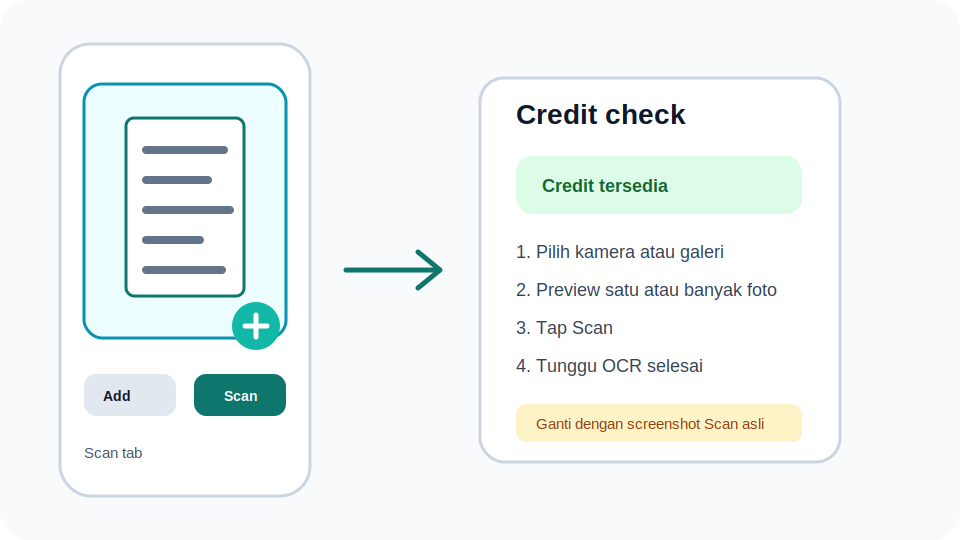
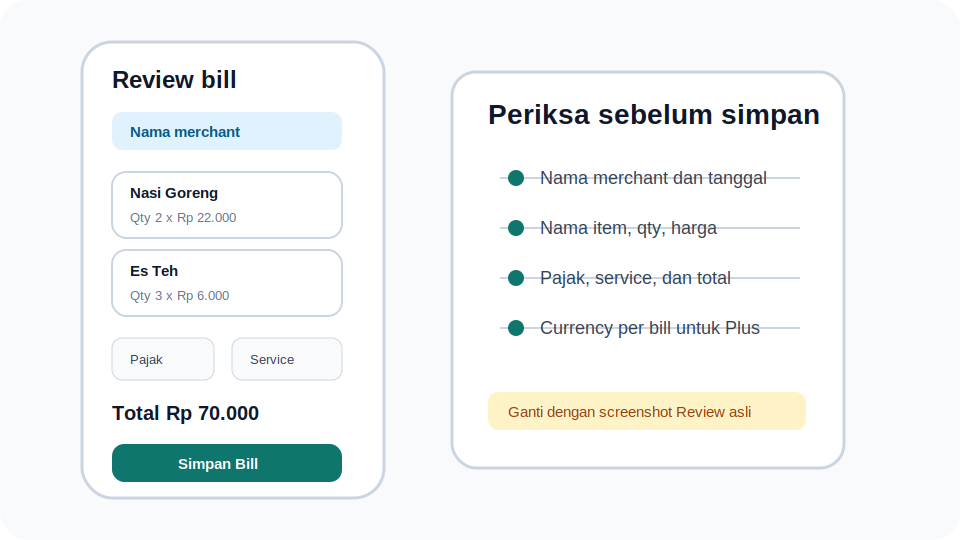
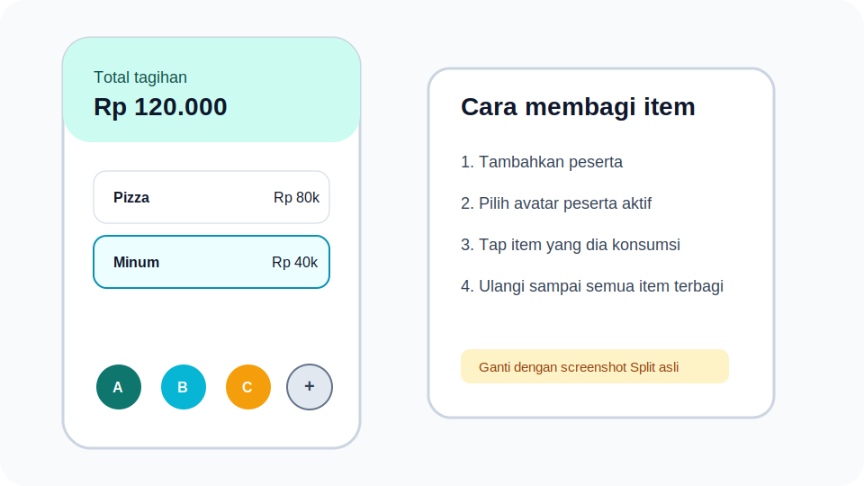
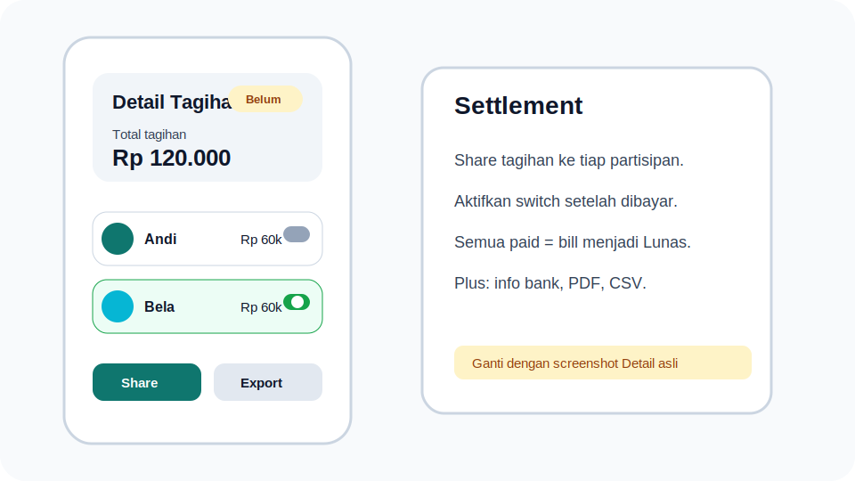
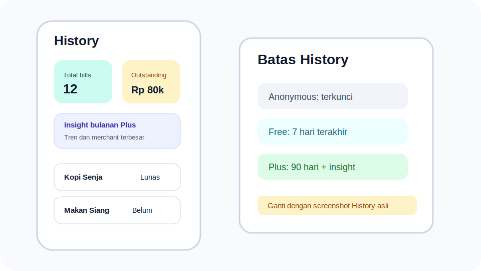
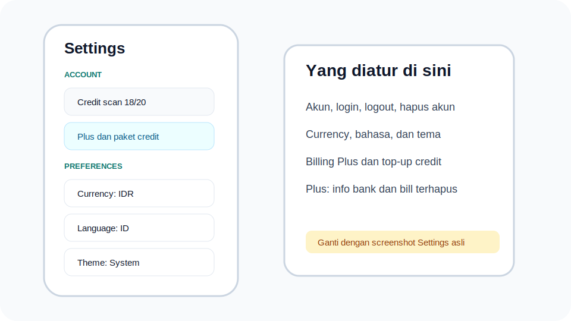
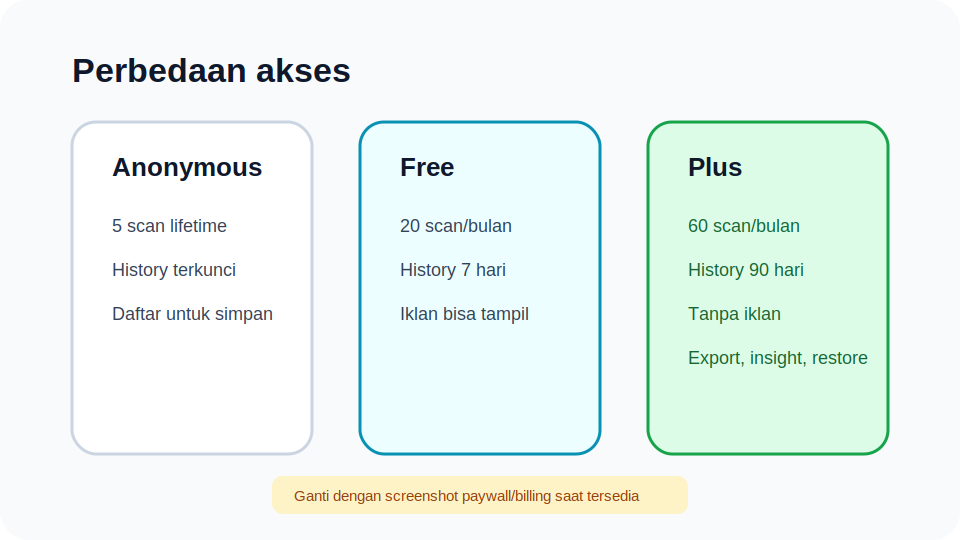

# BagiStruk User Guide

**Last updated:** 2026-06-09

This guide explains how to use BagiStruk from receipt scanning to settlement, including how to use History, Settings, and the differences between Anonymous, Free, and Plus access.

> Asset note: the images in this guide are still SVG placeholders. Replace them with real app screenshots once the final UI is ready so users see the same screens they will use in the app.

## Main Flow Summary

The main BagiStruk flow is:

1. Add receipt photos from the camera or gallery.
2. Scan the receipt so the app can read items, prices, tax, service charge, merchant, and date.
3. Review the scan result, then fix anything that looks wrong.
4. Save the bill.
5. Add participants.
6. Select a participant, then tap the items assigned to that person.
7. Review the split details.
8. Open the bill detail screen to share payment requests and track settlement.
9. The bill is automatically marked as settled once all participants are marked as paid.

**Replace this placeholder with:** the Scan tab showing one or more receipt photo previews, the **Add Photos** button, the **Scan** button, and the credit/processing status if visible.

## 1. Scan Receipts

Open the **Scan** tab. Tap **Add Photos**, then choose:

- **Camera** to take receipt photos directly.
- **Gallery** to select one or more photos from your gallery.

For long receipts, you can add multiple photos. Try to use bright, clear photos with the item list and total visible.

After the photos appear in the preview, tap **Scan**. The app checks your scan credit first. If credit is available, the photos are sent to OCR and AI processing.

Important notes:

- A scan only consumes credit when processing returns a valid receipt result.
- If the image is not a receipt or the result is too uncertain, the app may reject it and ask you to try again.
- For receipts with thousands separators such as `15.300`, always review the extracted values before saving.

## 2. Review Scan Results

**Replace this placeholder with:** the **Review bill** screen after OCR succeeds, ideally showing the merchant name, date, currency chip, several items, tax/service fields, total, and the **Simpan Bill** or save button.

After a successful scan, you will land on the **Review bill** screen. This is a required step before data is saved.

Check these fields:

- **Merchant name**: edit it if OCR read it incorrectly or left it blank.
- **Receipt date**: shown when detected from the receipt.
- **Currency**: follows your default currency from Settings. Plus users can change currency per bill during review.
- **Items**: check item names, quantities, and unit prices.
- **Tax** and **Service**: check any extra charges that will be split proportionally across participants.
- **Total**: compare it with the receipt total.

You can:

- Edit item names, quantities, and prices.
- Add an item with **Tambah item**.
- Delete an item by swiping it left.
- Fill in or adjust tax and service charge.

If you see a warning that the calculated total differs from the receipt total, check the items, tax, service charge, or number formatting before saving.

Once everything looks correct, tap **Simpan Bill**. The app saves the bill and opens the **Split bill** screen.

## 3. Split Bill

**Replace this placeholder with:** the **Split bill** screen with at least two participants, one active avatar, several assigned items, and either the **Semua item sudah dibagi** status or the **Belum dibagi** amount.

On the **Split bill** screen, you assign items to the people sharing the bill.

Steps:

1. Tap **Tambah** in the bottom-right area.
2. Enter the participant name.
3. Tap a participant avatar/name to make that participant active.
4. Tap the items that belong to that participant.
5. If one item is shared by multiple people, select another participant and tap the same item again.
6. Repeat until every item is assigned.

The top section shows:

- Total bill amount.
- The unassigned item amount.
- Whether all items have been assigned.

The **Lihat Rincian** button appears after all items are assigned and at least one participant exists. Use it to review the split summary before continuing.

Tap **Selesai** to move to the bill detail or settlement screen.

## 4. Settlement

**Replace this placeholder with:** the **Detail Tagihan** screen showing **Belum lunas** or **Lunas** status, total amount, participant list, share buttons, payment switches, and export buttons if using a Plus account.

The **Detail Tagihan** screen is used to complete payment settlement.

On this screen, you can see:

- Bill or merchant name.
- Date.
- Total bill amount.
- **Belum lunas** or **Lunas** status.
- Progress showing how many participants have paid.
- The amount each participant needs to pay.

To settle a bill:

1. Share each participant's amount using the share button in their row.
2. Once a participant has paid, turn on the switch in that participant row.
3. When all participants are marked as paid, the bill automatically becomes **Lunas**.

Plus users can save transfer bank information in Settings. If bank information is filled in, it can be included in the shared settlement message.

Plus users can also export a bill as PDF or CSV from the bill detail screen.

## 5. Using History

**Replace this placeholder with:** the **History** tab for a Free or Plus account, showing summary cards, the History access banner, bill list, and monthly insight if using Plus.

The **History** tab shows saved bills.

In History, you can:

- See the total number of bills.
- See the outstanding total from unsettled bills.
- Open old bill details.
- Delete a bill.
- See settled bills through the green check icon.
- Pull to refresh the list.

History access limits:

- **Anonymous**: History is locked. Register an account to save and view bill history.
- **Free**: can view bills from the last 7 days.
- **Plus**: can view bills from the last 90 days.

When you delete a bill, it is moved to **Bill terhapus**. Plus users can restore deleted bills during the 30-day recovery period.

Plus users also get **monthly insight** in History, including current month total, average bill amount, bill count, outstanding amount, monthly trend, and top merchants.

## 6. Using Settings

**Replace this placeholder with:** the **Settings** tab for a registered account, showing scan credit status, **Plus dan paket credit**, currency/language/theme preferences, and the **Info bank transfer** and **Bill terhapus** menu items.

Open the **Settings** tab to manage your account and app preferences.

The account section shows:

- Name or guest status.
- Email for registered accounts.
- Remaining scan credit.
- Plus and credit pack access.

Available settings:

- **Currency**: choose the default currency for scans and new bills.
- **Language**: choose Bahasa Indonesia or English.
- **Theme**: choose light, dark, or system theme.
- **Change name**: change the display name for registered accounts.
- **Reset password**: send password reset instructions for email accounts.
- **Transfer bank info**: save bank account details for settlement messages, Plus only.
- **Bill terhapus**: view and restore deleted bills, Plus only.
- **Delete Account**: delete your account and related app data.
- **About**: view app information, Privacy Policy, and Terms of Service.

For anonymous users, Settings shows a **Register Permanent** button. Use it to create a permanent account so your data is no longer tied only to an anonymous session.

## 7. Free, Anonymous, and Plus

**Replace this placeholder with:** the billing/paywall screen in Settings once Plus and credit pack products are active in Google Play, or a combined screenshot showing Anonymous, Free, and Plus credit status.

Main access differences:

| Feature | Anonymous | Free | Plus |
| --- | --- | --- | --- |
| OCR scan | 5 lifetime credits | 20 credits/month | 60 credits/month |
| History | Locked | Last 7 days | Last 90 days |
| Ads | May appear if ads are enabled | May appear if ads are enabled | Hidden |
| Per-bill currency during review | No | No | Yes |
| Monthly insight | No | Locked preview | Yes |
| PDF/CSV export | No | No | Yes |
| Bank info in settlement message | No | No | Yes |
| Restore deleted bills | No | No | Yes, within 30 days |
| Top-up credit packs | Requires account registration | Yes, if available | Yes, if available |

Monthly credits may expire at the end of the applicable period. Top-up credit packs, if available, are added after purchase verification succeeds.

## 8. Tips For More Accurate Scans

- Take receipt photos in bright lighting.
- Avoid shadows over the total and item list.
- Use multiple photos for long receipts.
- Make sure the total, tax, service charge, and item prices are readable.
- Review every number before tapping **Simpan Bill**.
- If the scan result is far off, remove the photo and scan again with a clearer image.

## 9. Delete Account

You can delete your account from **Settings > Delete Account**. The app asks for two-step confirmation, including typing a confirmation phrase.

After deletion succeeds:

- Bills and related app data for the account are deleted.
- The session returns to the initial flow.
- For registered accounts, the authentication user is also deleted from the backend.

Account deletion is a serious action. Make sure you no longer need the data before continuing.
